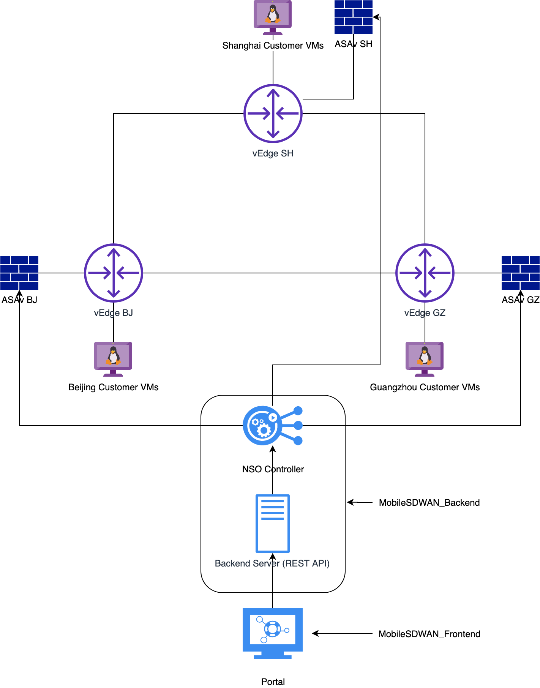

# MobileSDWAN_Backend
[](https://developer.cisco.com/codeexchange/github/repo/CiscoOctopus/MobileSDWAN_Backend)

Mobile SDWAN PoC Solution:

Cisco ASA + Cisco NSO + Cisco SDWAN = Mobile SDWAN solution

## Requirements
- Cisco NSO 5.0+
- Cisco ASA NED (cisco-asa-6.8)
- Cisco SD-WAN (Viptela)
- Linux Server

This is the backend Server for Mobile SDWAN,

For the front-end code, please check:
https://github.com/CiscoOctopus/MobileSDWAN_Frontend

## Description

This project is a PoC of a potential Mobile SDWAN solution powered by Cisco Orchestration tools (Requested by user)

Currently on Cisco SD-WAN side, the configuration needs to be preconfigured on vManage (NSO is not managing SD-WAN for current PoC)

This repo consist of two parts, the NSO service module and the Python backend.

## How it works

The ASA is connected to vEdgeCloud device's service VPN.

NSO is used to programatically add new user and assign correct VPN membership group

You can check the detail template under "asauser" folder.

The Python part use Tornado framework as a REST API Server.

It serves the requests from MobileSDWAN_Frontend, allowing Frontend to:
 - Create new VPN user
 - Modify/Delete existing VPN user
 - Check ASAv Server Info
 - Check latency info

It redirects the requests to NSO Restconf and create VPN per user's need.

## Demo Topology



Note that we support multi-customer in this design, so each customer has it's own VMs under different SDWAN VPN.

Since this is a PoC right now, we don't have public testbed available to use. You can follow the topology above to setup the topology.


## Install
```bash
# Under NSO work dir.
cp THISPROJECTPATH/asauser ./packages/
cd ./packages/asauser/src/
make all
```

Install Python Backend:
```bash
pip install -r requirements.txt
mv config.yaml.example config.yaml
vi config.yaml
# Modify the NSO info to fit your environment
# Also modify the ASAServer IP to fit correct server.
# Then run
python3 ./main.py
```

And your RESTAPI server will be running at 9888 port.

After deployed the Frontend code,
please modify Nginx to proxy_pass the API request to backend server.

